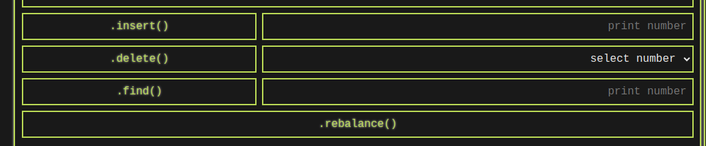

# Odin Binary Search Tree Visualizer

This project is a web application that allows users to interact with and visualize a balanced Binary Search Tree (BST) based on the assignment from [The Odin Project](https://www.theodinproject.com). Users can generate a random array, build a BST, and test various functions related to BSTs.

## Features

- **Generate Array:** Allows users to generate a random array of numbers.

- **Build BST:** Builds a Balanced Binary Search Tree (BST) from the generated array.

- **Insert Number:** Inserts a node with a printed value into the BST.

- **Delete Node:** Deletes a node chosen from a list. The list is generated based on the BST.

- **Find Number:** Looks for a printed number in the BST. If found, it shows its node height and depth.

- **Rebalance:** Rebuilds the BST in a balanced way.

## Usage

1. Visit the [Odin Binary Search Tree Visualizer](https://hrv3str.github.io/odin-binary-search-tree/) web application.

   
2. Click the **Generate Array!** button to generate a random array of numbers.

3. Click the **.build()** button to create a balanced BST.

4. Input a number and click **.insert()** to insert a node into the BST.

5. Look for needed number in the dropdown and click **.delete()** to delete a node from the BST.

6. Input a number and click **.find()** to find and display its node height and depth in the console.

7. Click **.rebalance()** to rebuild the BST in a balanced way.

## Credits

- [The Odin Project](https://www.theodinproject.com)
- [OpenAI ChatGPT](https://chat.openai.com/)

## Feedback and Contributions

- If you find this project useful, consider upvoting it on [this](https://www.theodinproject.com/lessons/javascript-binary-search-trees).

- Feel free to contribute and provide feedback on [GitHub](https://github.com/hrv3str/odin-binary-search-tree).

---

*(C) 2023 [hrv3str](https://github.com/hrv3str)*
